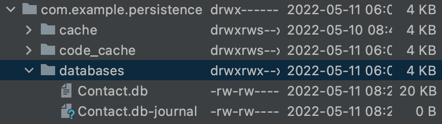
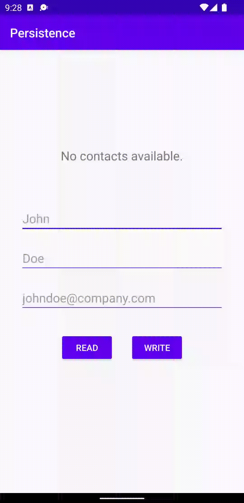

# Report

This assignment deals with the concept and practice of retrieving data from a local [SQLite](https://www.sqlite.org/index.html) database. That data will persist even after the application has finished executing.

## SQLite

The **.db** file is found on the device and will remain there even after the application closes.



## DatabaseTables

The first step is to create a class that holds any constants related to the SQL queries, so that future modifications to those queries can be performed from a centralized location. One added benefit of this approach is that it minimizes mistakes when referencing tables and columns from other parts of the application.

```java
public class DatabaseTables {
    static class Contact {
        static final String TABLE_NAME = "contact";
        static final String COLUMN_NAME_ID = "id";
        static final String COLUMN_NAME_FIRST_NAME = "first_name";
        static final String COLUMN_NAME_LAST_NAME = "last_name";
        static final String COLUMN_NAME_EMAIL_ADDRESS = "email_address";
    }

    static final String SQL_CREATE_TABLE_CONTACT =
            "CREATE TABLE " + Contact.TABLE_NAME + " (" +
                    Contact.COLUMN_NAME_ID + " INTEGER PRIMARY KEY AUTOINCREMENT," +
                    Contact.COLUMN_NAME_FIRST_NAME + " TEXT," +
                    Contact.COLUMN_NAME_LAST_NAME + " TEXT," +
                    Contact.COLUMN_NAME_EMAIL_ADDRESS + " TEXT)";

    static final String SQL_DELETE_TABLE_CONTACT = "DROP TABLE IF EXISTS " + Contact.TABLE_NAME;
}
```

## DatabaseHelper

Once the constants are in place, the next step is to create a helper class which extends `SQLiteOpenHelper`. This class defines the lifecycle hooks that are used when the database is created, as well as when the database version is changed.

```java
public class DatabaseHelper extends onUpgrade {
    private static final int DATABASE_VERSION = 1;
    private static final String DATABASE_NAME = "Contact.db";

    DatabaseHelper(Context context) {
        super(context, DATABASE_NAME, null, DATABASE_VERSION);
    }

    @Override
    public void onCreate(SQLiteDatabase sqLiteDatabase) {
        sqLiteDatabase.execSQL(DatabaseTables.SQL_CREATE_TABLE_CONTACT);
    }

    @Override
    public void onUpgrade(SQLiteDatabase sqLiteDatabase, int oldVersion, int newVersion) {
        sqLiteDatabase.execSQL(DatabaseTables.SQL_DELETE_TABLE_CONTACT);
        onCreate(sqLiteDatabase);
    }
}
```

## MainActivity

The `addContact` method is added to the **MainActivity** class, so that any logic that deals with inserting data into the database is kept separate from the rest of the application.

```java
private long addContact(String firstName, String lastName, String emailAddress) {
    ContentValues contentValues = new ContentValues();
    contentValues.put(DatabaseTables.Contact.COLUMN_NAME_FIRST_NAME, firstName);
    contentValues.put(DatabaseTables.Contact.COLUMN_NAME_LAST_NAME, lastName);
    contentValues.put(DatabaseTables.Contact.COLUMN_NAME_EMAIL_ADDRESS, emailAddress);
    return database.insert(DatabaseTables.Contact.TABLE_NAME, null, contentValues);
}
```

The same is true for the `getContacts` method, which returns a list of `Contact` objects, based on the data that is retrieved from the database at the time of execution.

```java
private List<Contact> getContacts() {
    List<Contact> contacts = new ArrayList<>();

    Cursor cursor = database.query(DatabaseTables.Contact.TABLE_NAME, null, null, null, null, null, null);
    while (cursor.moveToNext()) {
        contacts.add(new Contact(
                cursor.getLong(cursor.getColumnIndexOrThrow(DatabaseTables.Contact.COLUMN_NAME_ID)),
                cursor.getString(cursor.getColumnIndexOrThrow(DatabaseTables.Contact.COLUMN_NAME_FIRST_NAME)),
                cursor.getString(cursor.getColumnIndexOrThrow(DatabaseTables.Contact.COLUMN_NAME_LAST_NAME)),
                cursor.getString(cursor.getColumnIndexOrThrow(DatabaseTables.Contact.COLUMN_NAME_EMAIL_ADDRESS))
        ));
    }

    cursor.close();
    return contacts;
}
```

_Note how both methods heavily reference constants within the **DatabaseTables** class._

### Example

This is an example of how the `getContacts` method can be called to populate a list of `Contact` objects, so that the return value of the `toString` method for the **Contact** class can be appended to the `TextView` widget in an iterative manner. Of course, it would also be possible to filter that data within the `getContacts` method before it is returned. However, no filtering is performed in this code excerpt.

```java
final Button buttonRead = findViewById(R.id.button_read);
buttonRead.setOnClickListener(view -> {
    List<Contact> contacts = getContacts();

    if (contacts.isEmpty()) {
        Toast.makeText(this, "No contacts available.", Toast.LENGTH_LONG).show();
        return;
    }

    final TextView contactsList = findViewById(R.id.contacts_list);
    contactsList.setText("");

    for (int i = 0; i < contacts.size(); i++) {
        contactsList.setText(contactsList.getText() + contacts.get(i).toString() + "\n");
    }
});
```

## Demonstration

<p align="center">
  
</p>
